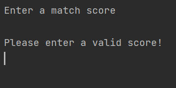
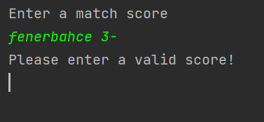
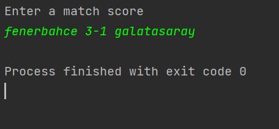

# Second Assignment

One main project and two different java projects in it with the maven build system

## The first project is the Consumer project that makes:
- Reads the .txt file
- Prints the content to command screen

## The second project is the Produder project that makes:
- Takes input from the command screen 
- Saves it to the .txt file

### Input Format:1st_team 1st_team_score-2nd_team_score 2nd_team

#### Test Cases
No input->

Only one team->

Correct input->

