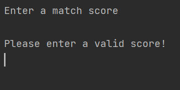
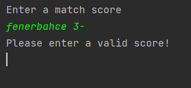
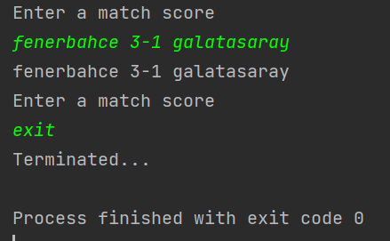

# Third Assignment

In addition to the 2nd project, this process was done with a thread

## The first class is the Consumer project that makes:
- Reads the .txt file
- Prints the content to command screen

## The second class is the Produder project that makes:
- Takes input from the command screen until ***Exit*** keyword typed
- Saves it to the .txt file

#### Test Cases
No input->

Only one team->

Correct input->

